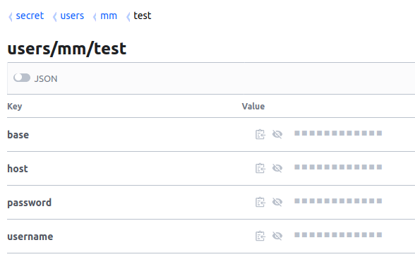
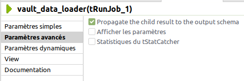
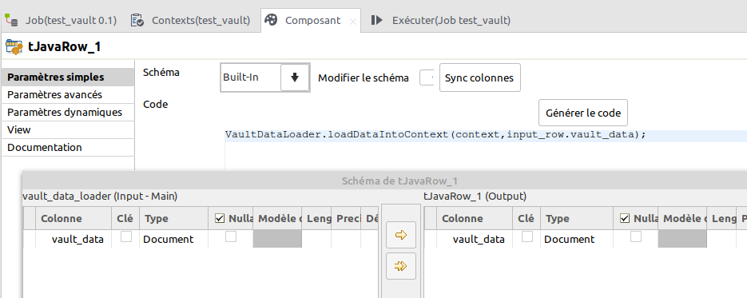
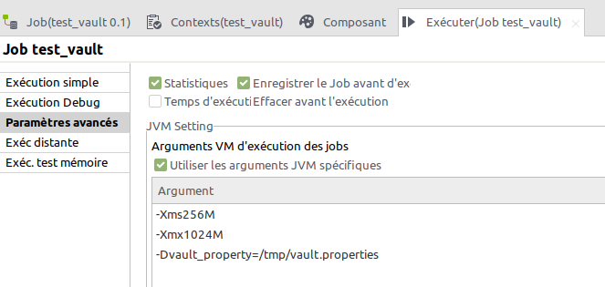

# Vault Data Loader

Ce job est conçu pour récupérer des données depuis votre service vault, données qui pourront être utilisées dans votre job talend. Les données récupérées sont inscrites dans le context d'exécution.


### Vault secrets to context

Les données issues du Vault sont injectées dans le contexte avec le prefixe 'vault_', uniquement si les variables de contexte sont définies.

Pour l'exemple ci-dessous, les données du contexte disponibles seraient :

 * vault_password
 * vault_username
 * vault_host
 * vault_base




### Using job

L'utilisation du job se fait avec les deux composants **tRunJob** et **tJavaRow**.


Pour utiliser ce job, vous devrez :

 1. définir les variables de contexte que vous souhaitez utiliser
 2. créer et configurer un composant tRunJob qui va exécuter le job *vault_data_loader* et également définir le schéma des données en sortie
 3. créer et configurer un composant tJavaRow qui va récupérer les données en sortie pour les injecter dans le contexte.
 4. configurer votre job global pour charger un fichier de properties qui contient les données de configuration de votre vault.
 

#### 1. Define context variables


#### 2. Configure tRunJob

Les donnnées générées par le job *vault_data_loader* sont exportées avec un **tBufferOutput**. Vous devez donc cocher la case **Propagate the child result to the output schema**.



Ajouter dans le schéma de sortie la variable **vault_data** de type *Document*.


#### 3. Configure tJavaRow

Dans le composant **tJavaRow**, synchroniser les colonnes pour récupérer le schéma d'entrée et saisissez le code suivant :

```
VaultDataLoader.loadDataIntoContext(context, input_row.vault_data);
```


La fonction *loadDataIntoContext()* dans la classe *VaultDataLoader* va lire les données de  *vault_data* et injecter les données dans le contexte.




### 4. Configure execution

La configuration de votre vault doit être stocké dans un fichier .properties. Il vous faut donc configurer la variable système *vault_property* à l'exécution en renseignant le chemin complet vers ce fichier de propriétés.

Pour l'exécution du job dans Talend Studion, définissez la variable dans les paramètres avancés du job avec l'argument VM suivant :

```
-Dvault_property=full_path_of_property_file
```



Exemple de fichier de properiétés :


```
vault_token=df6dkl54.token
vault_addr=https://vault.example.org
vault_path=/v1/secret/data/users/mm/test
vault_jks_file=/tmp/vault.jks
vault_jks_password=jkspassword
```

Pour créer votre keystore vault.jks, si nécessaire, vous devez dans un premier temps récupérer le certificat SSL de votre serveur vault et créer le keystore avec la commande suivante :

```
keytool -importcert -file vault-cert.pem -keystore vault.jks -alias "vault.example.org"
```

En production, éditez votre script d'exécution (.bat or .sh) pour y inclure le paramètre -Dvault_property.
