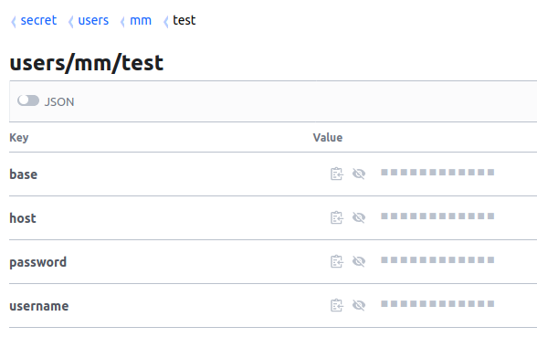
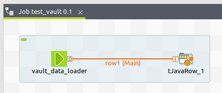
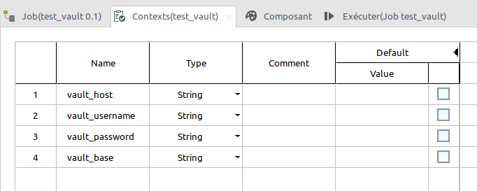
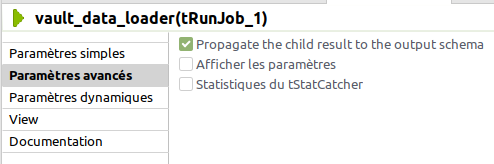
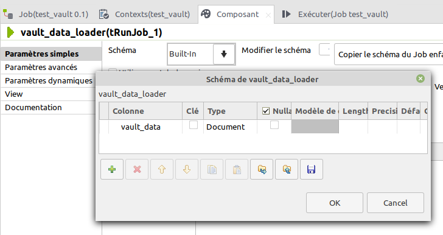
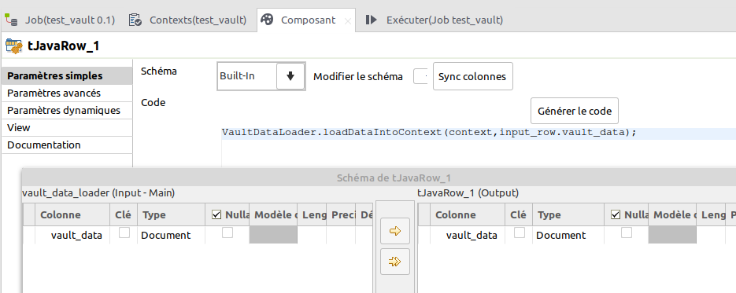
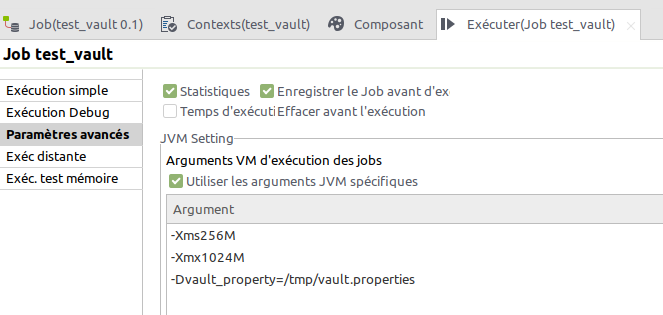

# Vault Data Loader

Use this job to retrieve data from your vault instance to use it in your job. The data retrieved will be put into job context.


### Vault secrets to context

Vault keys will be inject into context into variables prefixed with 'vault_' if defined.

For example, those secret will be exported as 

 * vault_password
 * vault_username
 * vault_host
 * vault_base




### Using job

Use the job with **tRunJob** and **tJavaRow** components.




To use the job, you will have to :

 1. define context variables you want to use according data in your vault
 2. create and configure a tRunJob which will run the *vault_data_loader* and define output schema
 3. create and configure a tJavaRow which will consume data and inject them into context
 4. configure your job execution to load a properties file which contains vault configuration


#### 1. Define context variables



#### 2. Configure tRunJob

Data from Vault Data Loader job are exported with a **tBufferOutput**. So you need to check the **Propagate the child result to the output schema**.



Add **vault_data** in schema of type *Document*.




#### 3. Configure tJavaRow

In **tJavaRow** component, sync schema and add the following code :

```
VaultDataLoader.loadDataIntoContext(context, input_row.vault_data);
```

The *loadDataIntoContext()* function in *VaultDataLoader* class will read data from *vault_data* Document, and inject them into context.




### 4. Configure execution

Configuration must be stored in a property file. Set the system property *vault_property* at execution time with the full path of this property file.

When execution job in Talend Studio, set the vault_property file in job parameters as follow :

```
-Dvault_property=full_path_of_property_file
```




Property file example :

```
vault_token=df6dkl54.token
vault_addr=https://vault.example.org
vault_path=/v1/secret/data/users/mm/test
vault_jks_file=/tmp/vault.jks
vault_jks_password=jkspassword
```

To create your vault.jks keystore, if needed, you have to get the vault SSL certificate and create the keystore with the following command :

```
keytool -importcert -file vault-cert.pem -keystore vault.jks -alias "vault.example.org"
```

In production, edit your launch script (.bat or .sh) to include the -Dvault_property parameter.